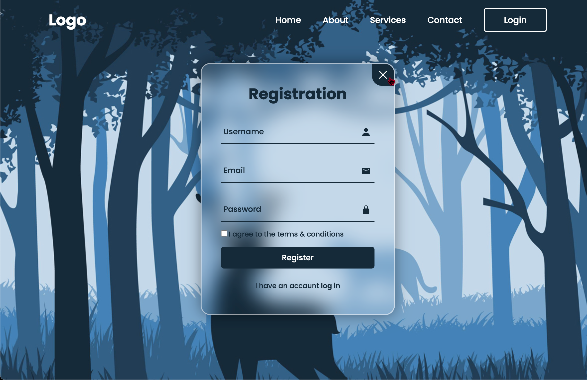

# 🔐 Login & Registration Form with LocalStorage

This is a simple login and registration form built with **HTML, CSS, and JavaScript**.  
It uses **localStorage** to save and manage user data directly in the browser.

### 💡 Features

- Switch between **Login** and **Registration** forms
- Save user data (name, email, password) in `localStorage`
- Display personalized welcome message after login
- Support for logout
- UI with basic animations and icons (via Ionicons)
- Checks login credentials and displays errors if invalid
- Smooth toggle between forms (Login ↔ Register)

---

### 🖼 Preview

## 

### 🛠 Technologies Used

- **HTML5**
- **CSS3**
- **Vanilla JavaScript**
- [Ionicons](https://ionic.io/ionicons)

---

### 🧠 How It Works

- When a user registers, their data is stored in `localStorage`
- On next visit, if data exists, the user sees a greeting and logout button
- If the user logs out, data is removed and the login form is shown again

---

### 🚀 Getting Started

1. Clone or download this repository
2. Open `index.html` in your browser
3. Try registering a new user
4. Then log in using the same email and password
